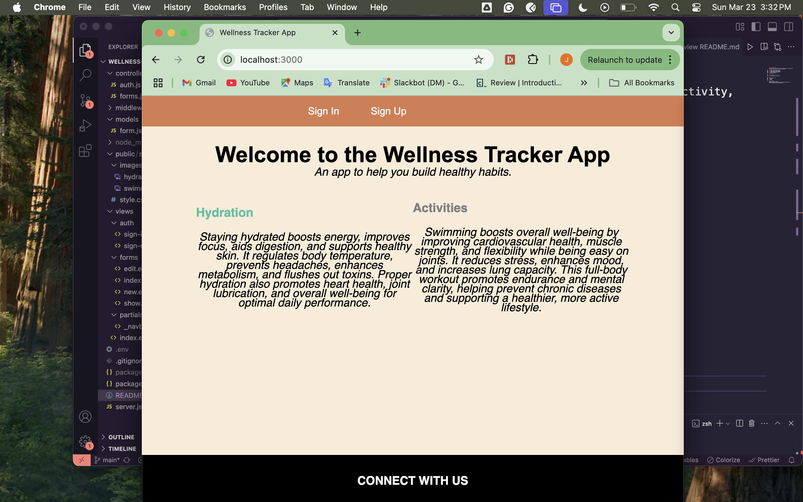
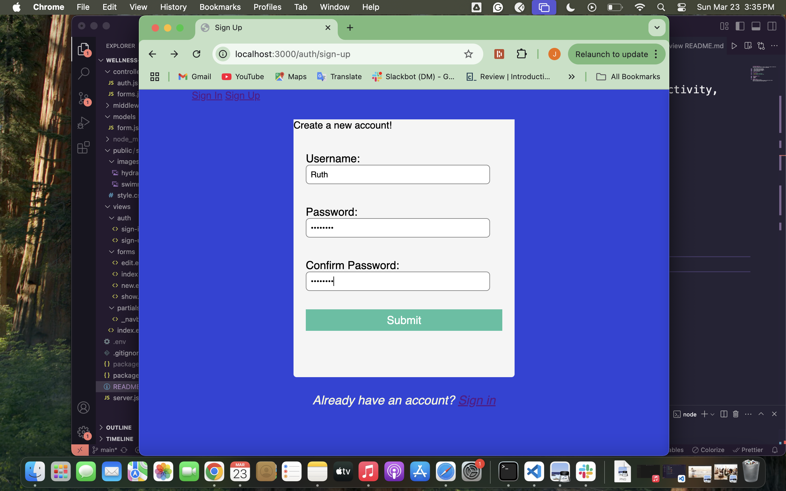
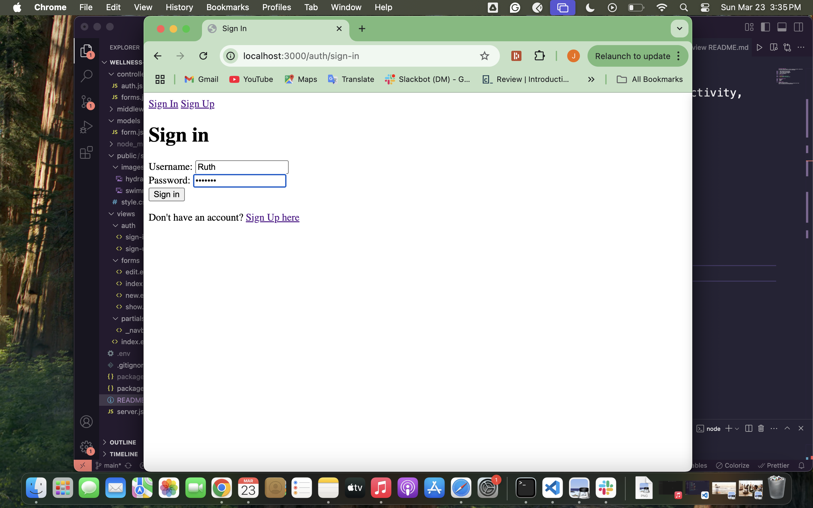
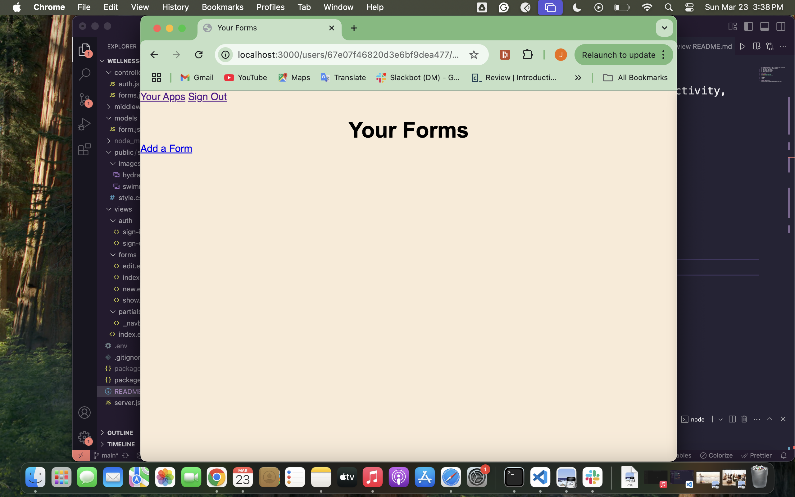
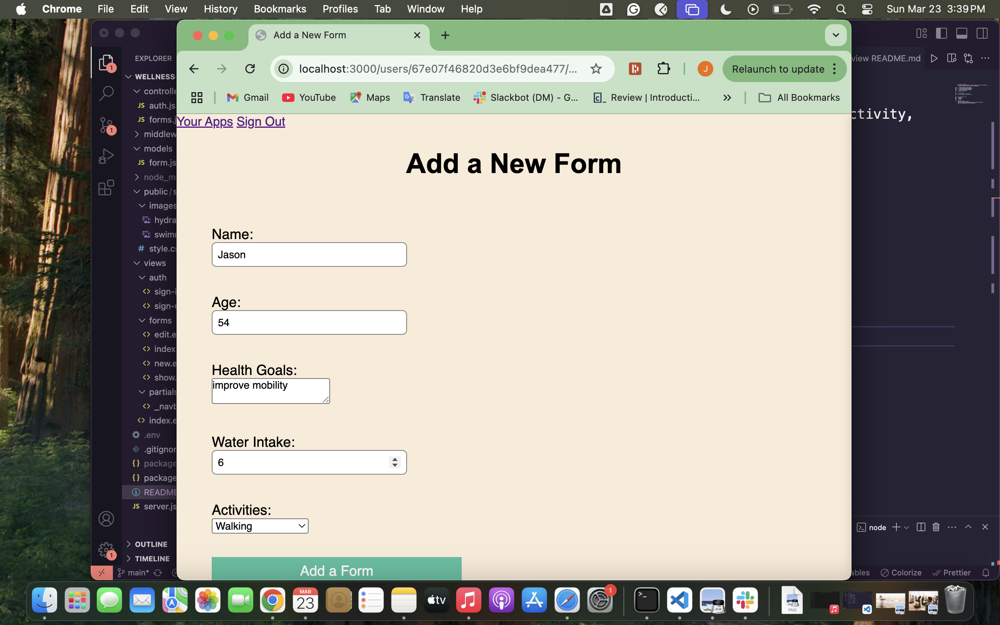

# wellness-tracker-app
Can provide numerous benefits in order to improve your health, productivity, and overall well-being. Here are some key advantages:

1.  Habit Formation & goal Settings.
2.  Health Monitoring and Awareness.
3.  Stress & Mental Health Management.
4.  Improved Productivity & Focus.
5. Better sleep Quality.

Project planning link:https://trello.com/invite/b/67d49ffee85fdd4809128063/ATTI23646ac616940579e6958091d82abb27C165106D/wellness-tracker

## Attributions:

1. [Trello](https://trello.com)
2. [draw.io](https://www.drawio.com)

### Technologies used:
- JavaScript
- MongoDB
- bcrypt

#### Next steps
- Integrate with smart devices .
- Uses AI to provide tailored advice based on personal data trends.
- Syncs with wearables(like Fitbit,Apple Watch)